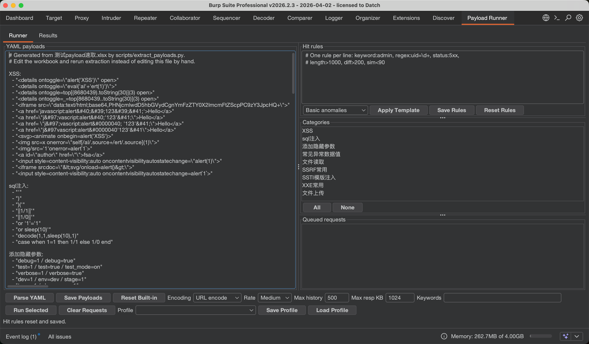
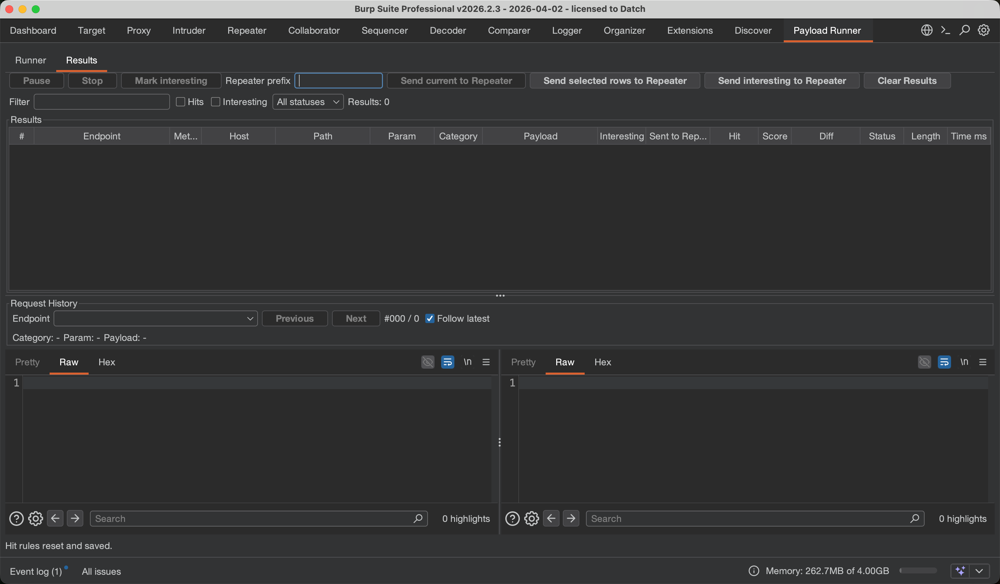

# Payload Runner Burp Extension

Payload Runner is a Java Burp Suite extension MVP. It adds a context menu action,
`Send to Payload Runner`, then runs categorized payloads against request body
parameters whose values contain `*`.

## Features

- Context menu: `Send to Payload Runner`
- URL query parameters whose values contain `*`, including POST request lines
- Body formats:
  - `application/x-www-form-urlencoded`
  - JSON bodies
  - `multipart/form-data`
  - XML attribute values and text nodes
- Marks insertion points by finding URL/body values that contain `*`
- YAML payload categories
- Editable payload YAML with save/reset controls
- Multi-select categories before running
- Encoding strategy per run:
  - `URL encode`
  - `JSON escape`
  - `Raw`
- Request rate presets:
  - `Low`
  - `Medium`
  - `High`
- Endpoint profiles for saving and loading runner settings
- Pause/resume and stop controls
- Keyword matching against responses
- Internal Request History grouped by endpoint
- Max response KB limit for stored history response bytes
- Manual Repeater sending for current, selected, or interesting history records
- Optional Repeater tab caption prefix for manual sends
- Result filters for text, hits, interesting records, and status classes
- Result score column for quickly sorting higher-signal responses
- Result table rerun actions for selected, failed, hit, or interesting rows
- Built-in hit rule templates
- Hit rules:
  - `keyword:admin`
  - `regex:uid=\d+`
  - `status:500` or `status:5xx`
  - `length>1000`
  - `diff>200`
  - `sim<90`
- Response diff against the original Burp message response
- Results table with endpoint, Repeater send status, interesting flag, hit, diff, status code, response length, and elapsed time
- Click a result row to open its generated request and response in the History Viewer
- Export all, selected, or interesting results to CSV
- Export selected request/response message files
- Built-in payload YAML extracted from `测试payload速取.xlsx`

## Build

```sh
sh scripts/build.sh
```

The extension jar is written to:

```text
build/payload-runner-burp.jar
```

The build uses local compile-only Burp API stubs and excludes them from the jar,
so Burp's own API classes are used at runtime.

## Smoke Test

```sh
sh scripts/test.sh
```

The smoke test covers YAML parsing, marker replacement, rate presets, history
navigation, response truncation, scoring, profiles, rerun actions, manual
Repeater sending, result filtering, settings persistence, CSV export, extension
load output, and queue actions.

## Refresh Built-in Payloads

```sh
/Users/aur4r0/.cache/codex-runtimes/codex-primary-runtime/dependencies/python/bin/python3 scripts/extract_payloads.py 测试payload速取.xlsx src/main/resources/payloads.yaml
```

The workbook's first row is treated as category names. Non-empty cells under
each category become payload entries in the built-in YAML.

## Load in Burp

1. Open Burp Suite.
2. Go to `Extensions` -> `Installed`.
3. Click `Add`.
4. Select extension type `Java`.
5. Choose `build/payload-runner-burp.jar`.

After the extension is imported, Burp's extension output shows:

```text
Payload Runner loaded successfully.
Right-click a Burp request and choose Send to Payload Runner.
GitHub: https://github.com/Aur4r0/Payload-Runner
```

## Screenshots / 界面截图

### Runner



Runner 页面用于维护内置 YAML payload、编辑命中规则、套用规则模板、
选择 payload 分类、管理 queued requests，并配置编码策略、发包速率、
History 上限、响应保存大小、关键词和 endpoint Profile。

### Results and Request History



Results 页面用于查看状态码、长度、耗时、Score、Hit、Diff、Interesting 和
Sent to Repeater；上方提供过滤、手动发送到 Repeater、标记 interesting 和清空结果。
下方 Request History 可以按 endpoint 前进/后退浏览每个 payload 变体的请求和响应。

## 使用说明

1. 在 Burp 的任意请求里，把要跑 payload 的参数值位置标成 `*`。
   - URL 查询参数示例：`GET /search?q=* HTTP/1.1`
   - POST URL 查询参数示例：`POST /api?keyword=* HTTP/1.1`
   - form body 示例：`username=*&password=123`
   - JSON 示例：`{"keyword":"*"}`
   - multipart/XML 中的字段值同样支持 `*`
2. 在 Burp 请求列表、Repeater、Proxy history 等位置右键请求，选择
   `Send to Payload Runner`。
3. 打开 `Payload Runner` 插件页，在 `Runner` 页面确认：
   - `Queued requests`：要测试的请求队列。选中某几条时只跑选中的请求；
     不选中时跑整个队列。右键队列项可删除选中请求。
   - `Categories`：选择要运行的 payload 分类。`All` 选择全部，`None`
     清空选择。
   - `Encoding`：选择 payload 写入请求时的编码策略：`URL encode`、
     `JSON escape` 或 `Raw`。
   - `Rate`：选择发包速率，默认 `Medium`。`Low` 每包间隔约 1000ms，
     `Medium` 每包间隔约 250ms，`High` 不增加额外等待。
   - `Max history`：每个 endpoint 最多保留多少条完整请求/响应历史，默认 500；
     超过后释放最旧记录的请求/响应 bytes，结果表元数据仍保留。
   - `Max resp KB`：每条 History 记录最多保存多少 KB 响应 bytes，默认 1024；
     状态码、长度、diff 和命中判断仍基于完整响应，Viewer/消息导出使用截断副本。
   - `Keywords` / `Hit rules`：设置响应命中规则，也可以选择模板后点击
     `Apply Template` 快速填入常见规则。
   - `Profile`：按 endpoint 保存/加载当前分类、编码、速率、命中规则、关键词、
     History 限制和 Repeater 前缀。
4. 点击 `Run Selected` 开始运行。
   - 运行前会按分类对 payload 去重，状态栏会显示 unique payload 数和跳过的重复数量。
5. 在 `Results` 页面查看状态码、长度、耗时、命中规则、diff、Interesting 和
   Sent to Repeater。`Score` 越高代表命中、状态变化、diff 或耗时异常越明显。
   点击任意结果行会在 `Request History` 中定位到该变体。
   - `Filter`、`Hits`、`Interesting` 和状态码下拉框可以缩小结果表范围。
   - 右键结果表可以 `Rerun Selected`、`Rerun Failed`、`Rerun Hits` 或
     `Rerun Interesting`，重跑会使用当前编码、速率和命中规则，结果追加到表格和 History。
6. 在 `Request History` 中按 endpoint 浏览记录：
   - `Previous` / `Next` 在当前 endpoint 内前进后退。
   - `Follow latest` 默认开启，新结果会自动跳到最新记录；关闭后不会打断当前查看位置。
   - `Mark interesting` / `Unmark interesting` 手动标记值得复查的记录。
7. 需要把包送到 Burp Repeater 时，使用手动按钮：
   - `Repeater prefix`：可选命名前缀。填写 `查询` 时，tab 命名为
     `查询1`, `查询2`, `查询3`；留空时命名为 `1`, `2`, `3`。
   - `Send current to Repeater`：发送当前 History 记录。
   - `Send selected rows to Repeater`：发送结果表中选中的记录。
   - `Send interesting to Repeater`：发送所有已标记 Interesting 的记录。
8. 运行中可以 `Pause` / `Resume` / `Stop`。需要保存结果时选择导出范围
   `All` / `Selected` / `Interesting`，再点击 `Export CSV`；需要保存原始包时点击
   `Export Messages`。

## YAML Format

```yaml
xss:
  - "<script>alert(1)</script>"
  - "\" onmouseover=\"alert(1)"

sqli:
  - "' OR '1'='1"
  - "\" OR \"1\"=\"1"
```

Inline lists are also supported:

```yaml
ids: ["1", "2", "999999"]
```

## Runtime Notes

Payload edits and UI settings are saved through Burp extension settings.
`Reset Built-in` restores the bundled `payloads.yaml` generated from
`测试payload速取.xlsx`. Persisted UI settings include encoding, rate, max history,
Repeater prefix, and Follow latest.

Keyword matching accepts comma, semicolon, or newline separated terms and writes
matched terms into the result table's `Hit` column. Hit rules are editable in
the `Hit rules` panel and saved through Burp extension settings.

Response diff compares each payload response with the original response attached
to the Burp message that was sent to Payload Runner. If the source message has
no response, the `Diff` column is blank.

Rate limiting is applied between payload requests in the background runner
thread. It does not block the Swing UI, and Pause/Stop remain responsive during
rate waits.

Payload runs no longer auto-open Repeater tabs for every variant. Each mutated
request and response is stored in the plugin's Request History. Repeater only
receives records when you click one of the manual send buttons.

History endpoint grouping uses `METHOD + scheme + host + port + path`; query
parameters are intentionally excluded so variants of the same interface stay in
one list. Manual Repeater tab captions use the optional `Repeater prefix` plus
the per-click send batch index, or only the index when the prefix is empty.
Captions are capped at 80 characters. Repeater send failures are logged through
Burp extension stderr and do not stop the payload run.

When an endpoint exceeds `Max history`, old result rows stay in the table for
status review and CSV export, but their full request/response bytes are dropped
to keep memory bounded. Those dropped rows cannot be sent to Repeater unless you
rerun or increase the history limit before they are evicted.

`Max resp KB` limits only the response bytes stored in Request History. Result
metadata such as status, response length, elapsed time, score, hit rules, and
diff are calculated before truncation.

GitHub Actions runs `sh scripts/test.sh` and `sh scripts/build.sh` on pushes and
pull requests. Tags starting with `v` also build the jar and publish or replace
the Release asset.
